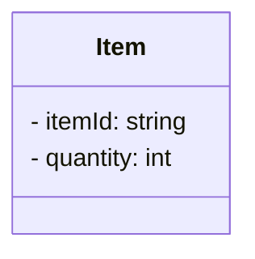
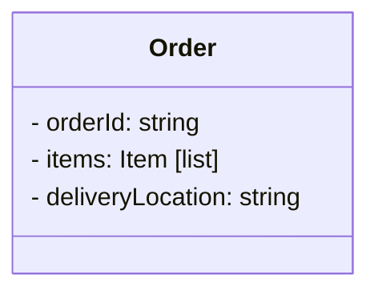
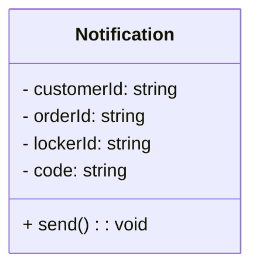

# Class Diagram

## Item

```mermaid
classDiagram

class Item{
    - itemId: string
    - quantity: int
}
```

## Order

```mermaid
classDiagram

class Order{
    - orderId: string
    - items: Item [list]
    - deliveryLocation: string
}
```

## Notification

```mermaid
classDiagram

class Notification{
    - customerId: string
    - orderId: string
    - lockerId: string
    - code: string

    + send(): void
}
```

## Package & Locker Package