# Class Diagram

## Button
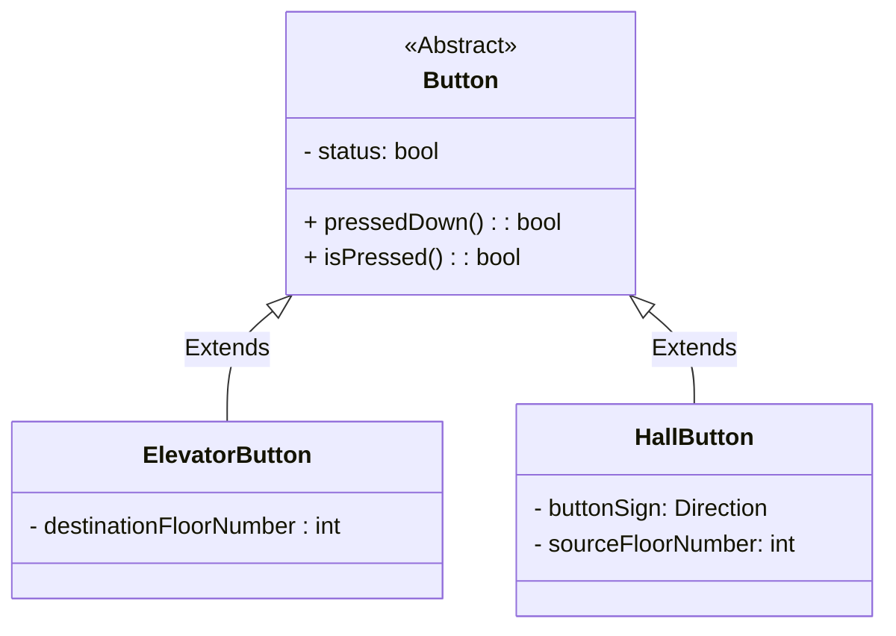

## Elevator & Hall Panel
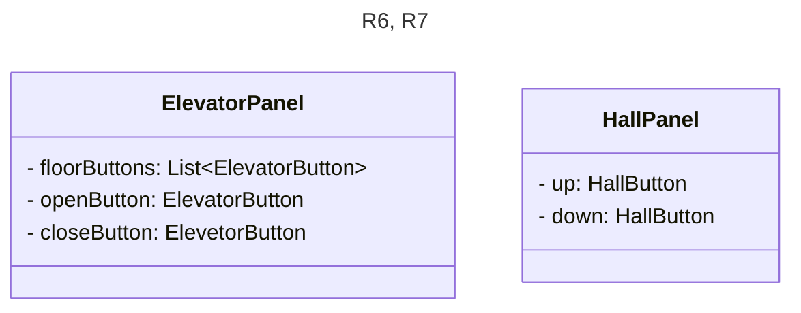

## Display
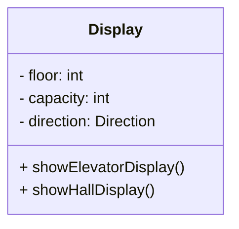

## Door
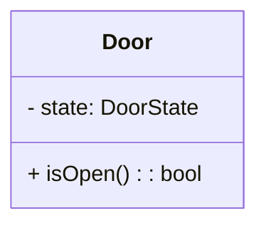

## Elevetor Car
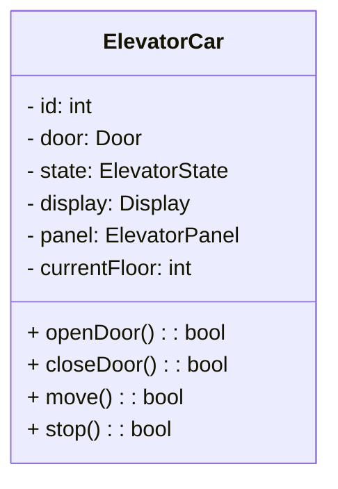

## Floor & Building
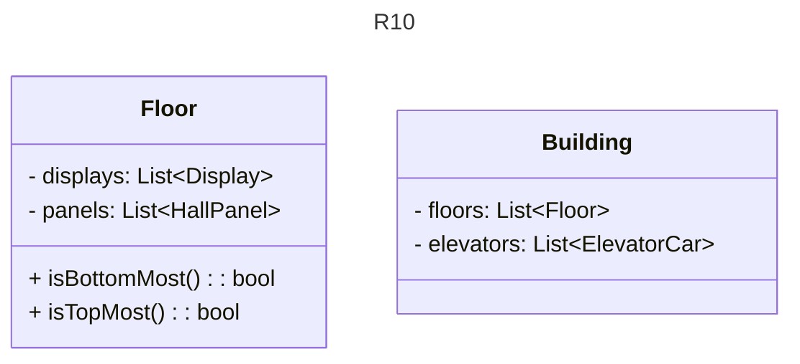

## Elevator System
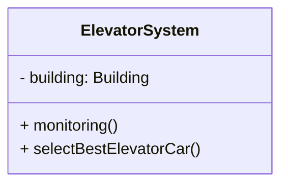

## Enumerations
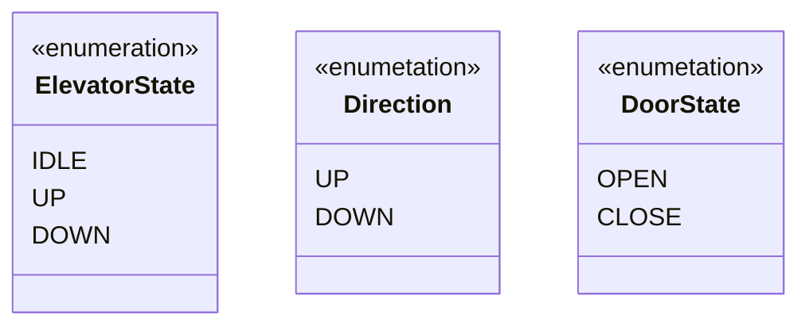

## Relationship

### Aggregation
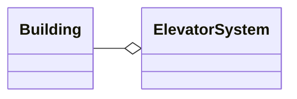

### Composition
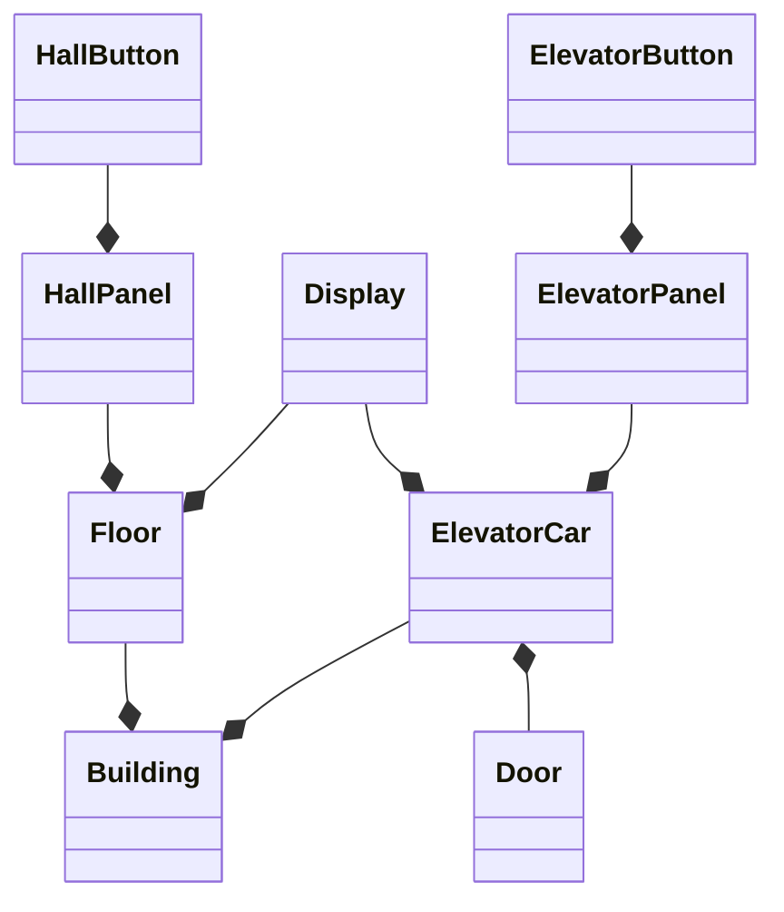

### Inheritance
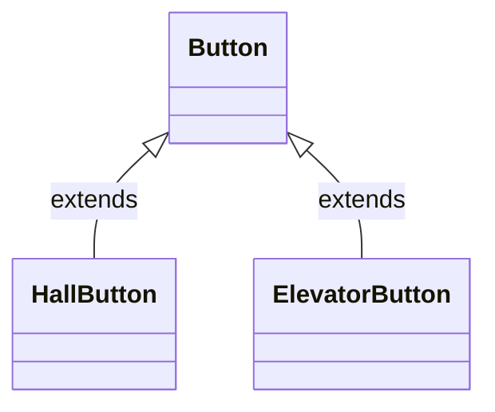

## Design Patterns
- **Strategy Pattern**: The system could have multiple dispatch requrest depending on the particular layout of the building and its senarios