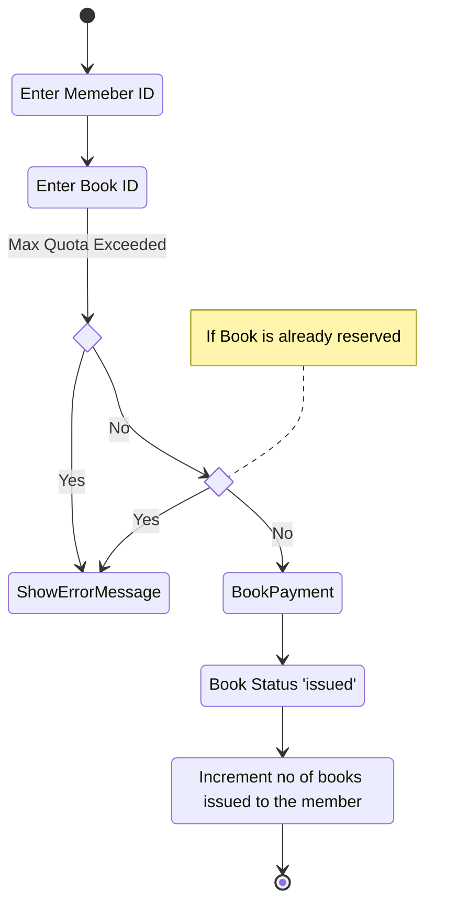
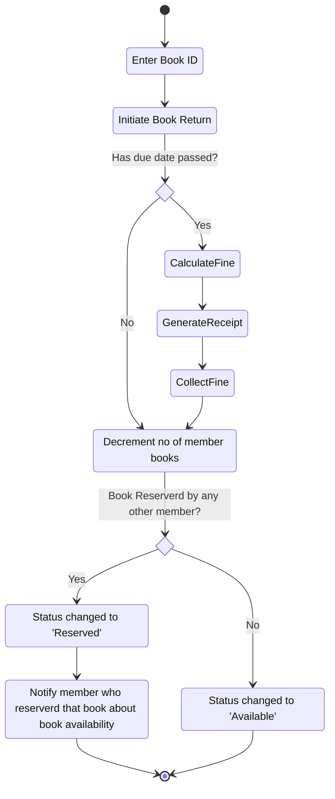
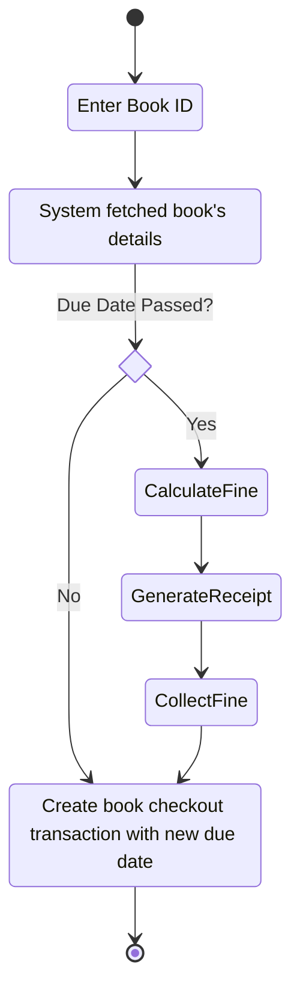

# Activity Diagram

## Checkout a book from the library

```mermaid
stateDiagram-v2
[*] --> EMI
EMI --> EBI
state if_MQE <<choice>> 

EBI --> if_MQE: Max Quota Exceeded
if_MQE --> ShowErrorMessage: Yes
state if_BookAlreadyReserved <<choice>>
if_MQE --> if_BookAlreadyReserved: No
if_BookAlreadyReserved --> ShowErrorMessage: Yes
if_BookAlreadyReserved --> BookPayment: No
BookPayment --> BookIssued
BookIssued --> IncrMemberBooks
IncrMemberBooks --> [*]

note left of if_BookAlreadyReserved
    If Book is already reserved
end note
EMI: Enter Memeber ID
EBI: Enter Book ID
BookIssued: Book Status 'issued'
IncrMemberBooks: Increment no of books issued to the member
```

## Return a book to the library

```mermaid
stateDiagram-v2
[*] --> EBID
EBID --> IBR 
state has_due_date_passed <<choice>>
IBR --> has_due_date_passed: Has due date passed?
has_due_date_passed --> CalculateFine: Yes
has_due_date_passed --> DecrMemberBooks: No
CalculateFine --> GenerateReceipt
GenerateReceipt --> CollectFine
CollectFine --> DecrMemberBooks
state is_book_reserverd <<choice>>
DecrMemberBooks --> is_book_reserverd: Book Reserverd by any other member?
is_book_reserverd --> StatusAvailable: No
is_book_reserverd --> StatusReserved: Yes
StatusReserved --> NotifyMembers

NotifyMembers --> [*]
StatusAvailable --> [*]

EBID: Enter Book ID
IBR: Initiate Book Return
DecrMemberBooks: Decrement no of member books
StatusAvailable: Status changed to 'Available'
StatusReserved: Status changed to 'Reserved'
NotifyMembers : Notify member who reserverd that book about book availability
```

## Renew a book from the library

```mermaid
stateDiagram-v2

[*] --> EBID
EBID --> FetchBook
state isDueDatePassed <<choice>>
FetchBook --> isDueDatePassed: Due Date Passed?
isDueDatePassed --> CalculateFine: Yes
isDueDatePassed --> NewDueDate: No

CalculateFine --> GenerateReceipt
GenerateReceipt --> CollectFine
CollectFine --> NewDueDate
NewDueDate --> [*]

EBID: Enter Book ID
FetchBook: System fetched book's details
NewDueDate: Create book checkout transaction with new due date
```