# Class Diagram
Contents
- [Classes](#classes)
- [Enumerations](#enumerations)
- [Custom Datatypes](#custom-datatype)
- [Relations](#relation-between-the-classes)
    - [Association](#association)
        - [One Way](#one-way)
        - [Two Way](#two-way)
    - [Composition](#composition)
    - [Aggregation](#aggregation)

## Classes
### Books
**Requirements 3, 4**

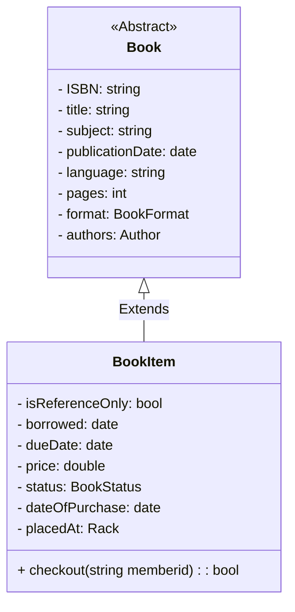

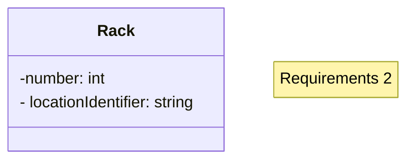
### Person & Author
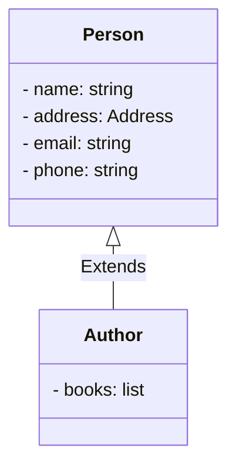

### Users: Librarian & Members
**Requirements: 5, 11**
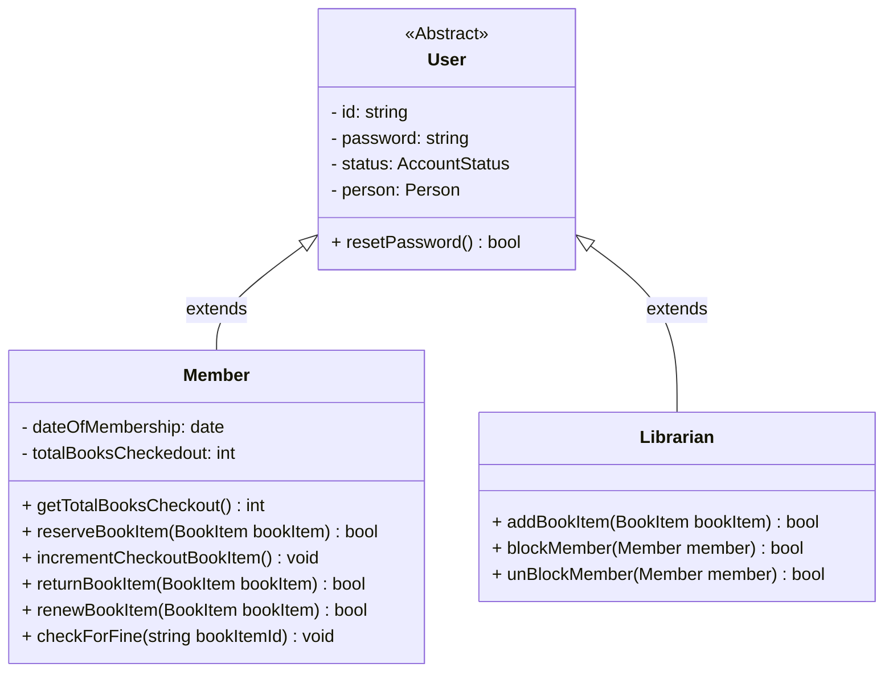

### Library Card
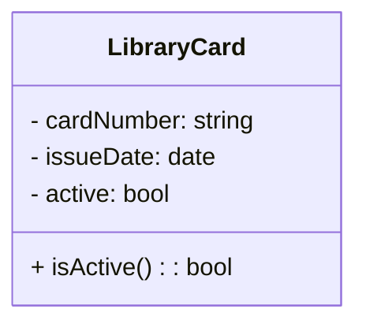

### Book Reservation
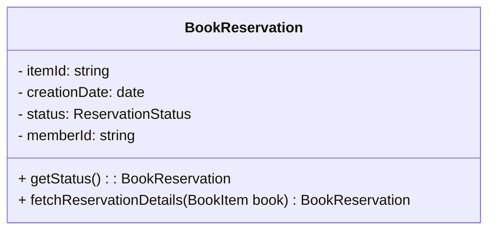

### Book Lending
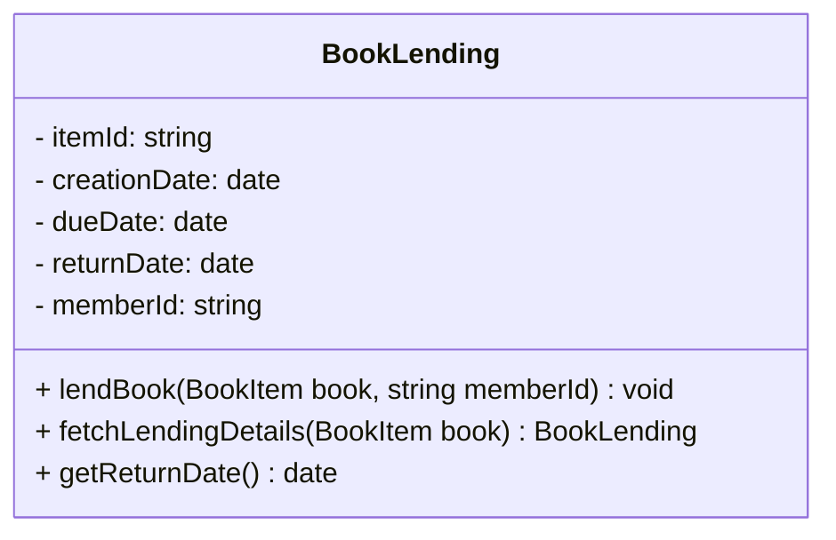

### Notification
**Requirements**
- 12

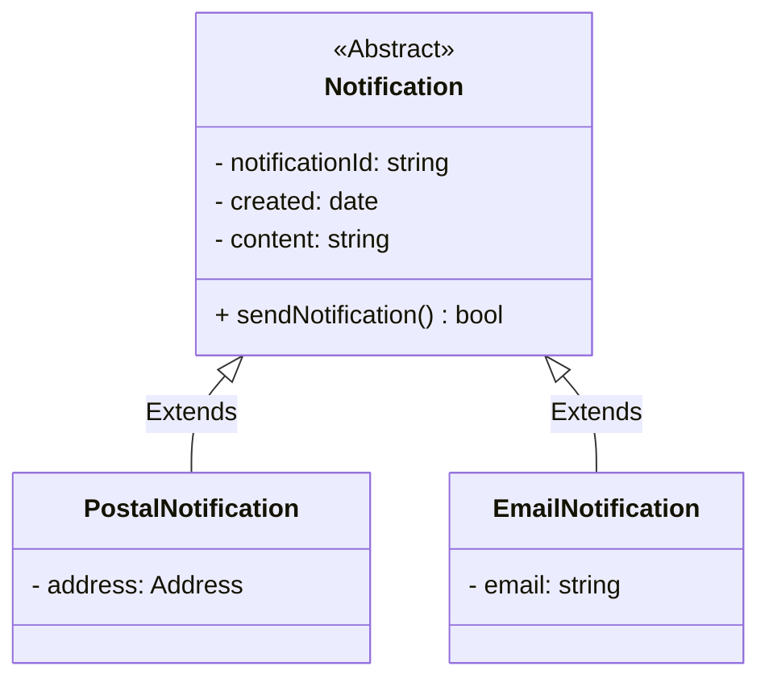

### Search & Catalog

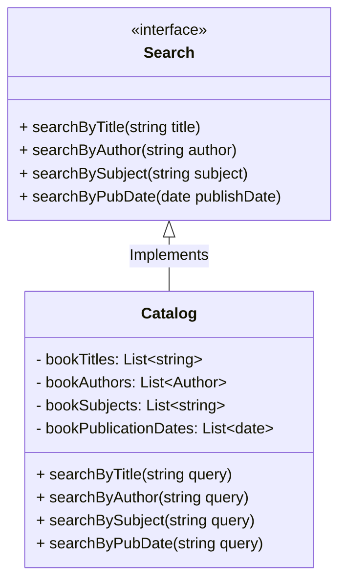

### Library
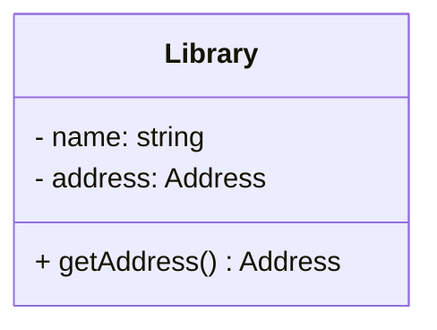

## Enumerations
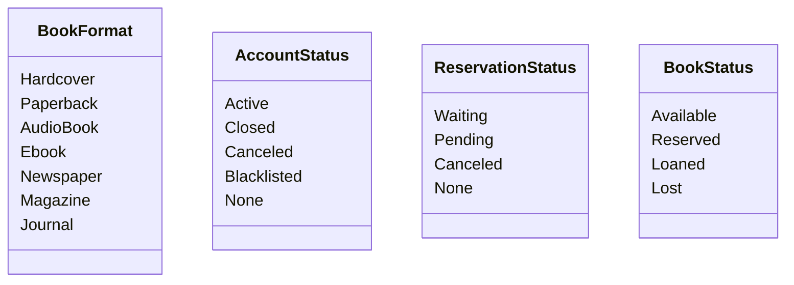

## Custom Datatype
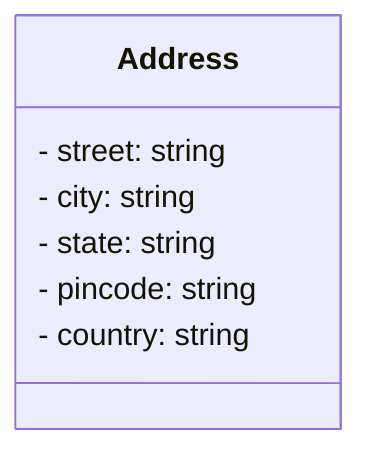

## Relation between the classes
### Association
#### One-Way
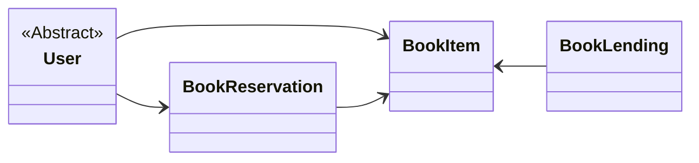

#### Two-Way
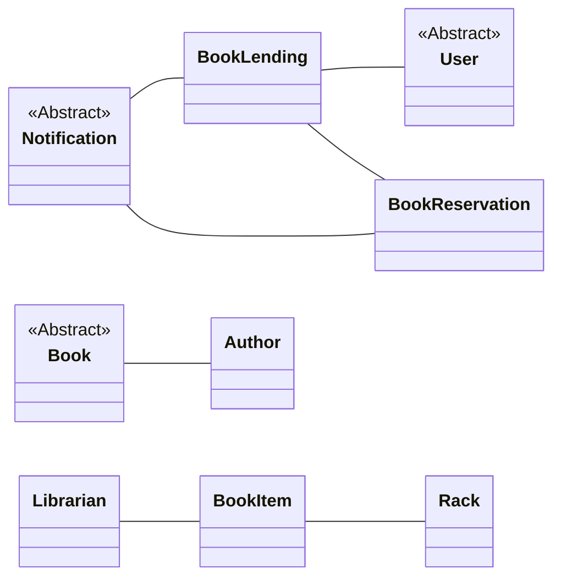

### Composition
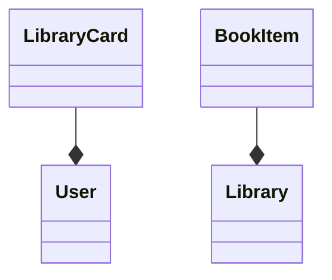
### Aggregation
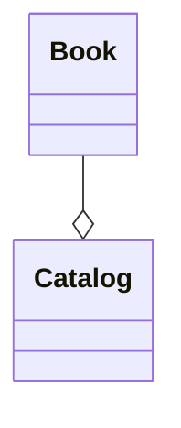

### Inheritance
