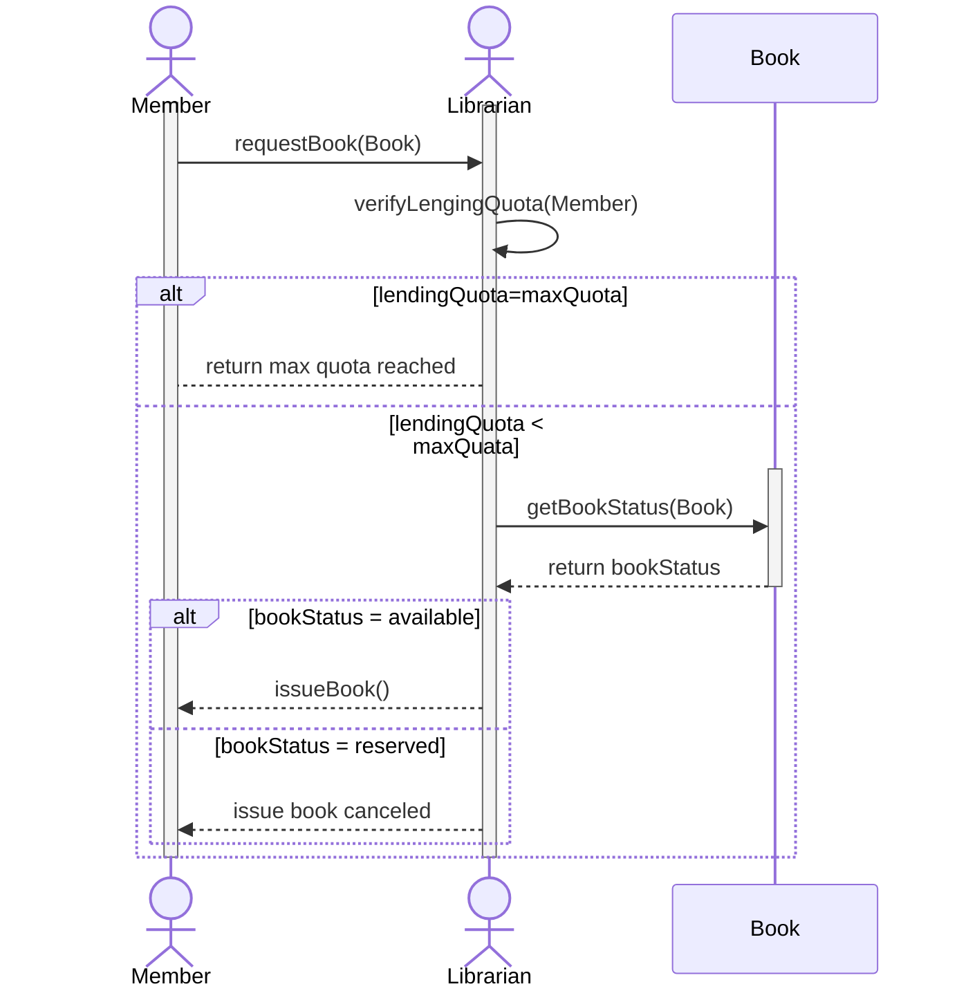
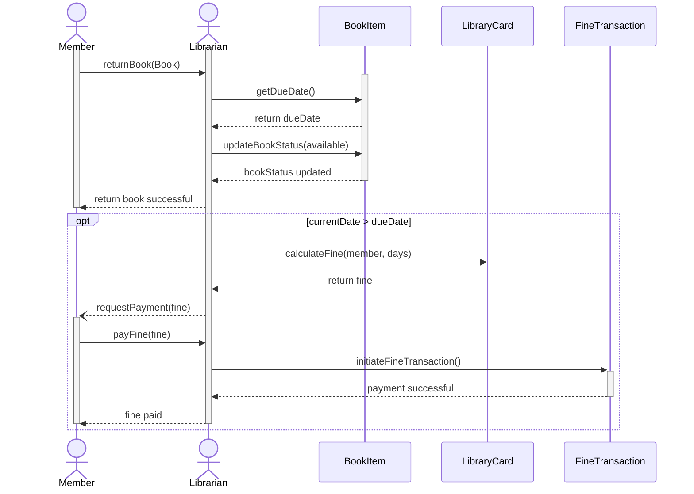

# Sequence Diagram

## Issue a book

```mermaid
sequenceDiagram
actor Member
actor Librarian
participant Book

activate Member
activate Librarian

    Member ->> Librarian: requestBook(Book)
    Librarian ->> Librarian: verifyLengingQuota(Member)

    alt lendingQuota=maxQuota
        Librarian --> Member: return max quota reached
    else lendingQuota < maxQuata
        activate Book
            Librarian ->> Book: getBookStatus(Book)
            Book -->> Librarian: return bookStatus
        deactivate Book

        alt bookStatus = available
            Librarian -->> Member: issueBook()
        else bookStatus = reserved
            Librarian -->> Member: issue book canceled
        end
    end

deactivate Librarian
deactivate Member


```
## Return a Book

```mermaid
sequenceDiagram
actor Member
actor Librarian
participant BookItem
Participant LibraryCard

activate Member
activate Librarian

    Member ->> Librarian: returnBook(Book)
    activate BookItem
        Librarian ->> BookItem: getDueDate()
        BookItem -->> Librarian: return dueDate
        Librarian ->> BookItem: updateBookStatus(available)
        BookItem -->> Librarian: bookStatus updated
    deactivate BookItem
    Librarian -->> Member: return book successful
deactivate Member
    opt currentDate > dueDate
        Librarian ->> LibraryCard: calculateFine(member, days)
        LibraryCard -->> Librarian: return fine
        Librarian --)+ Member: requestPayment(fine) 
        Member ->> Librarian: payFine(fine)
        Librarian ->>+ FineTransaction: initiateFineTransaction()
        FineTransaction -->>- Librarian: payment successful
        Librarian -->>- Member: fine paid
        deactivate Member
    end
```