# Class Diagram

## Seat
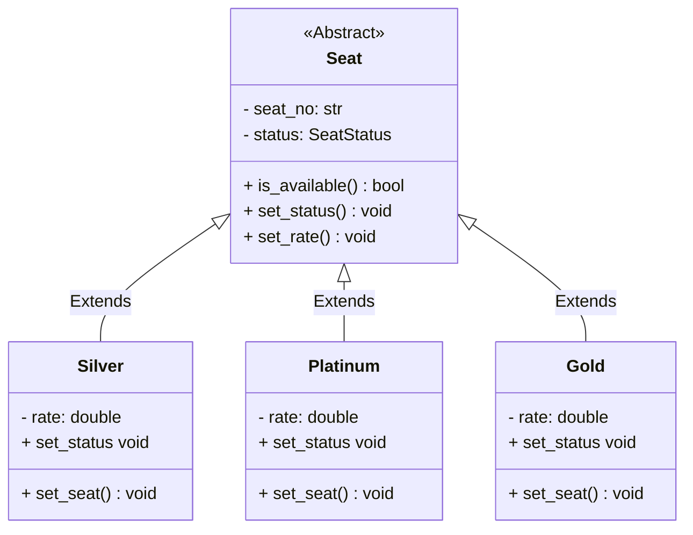

## Show Time
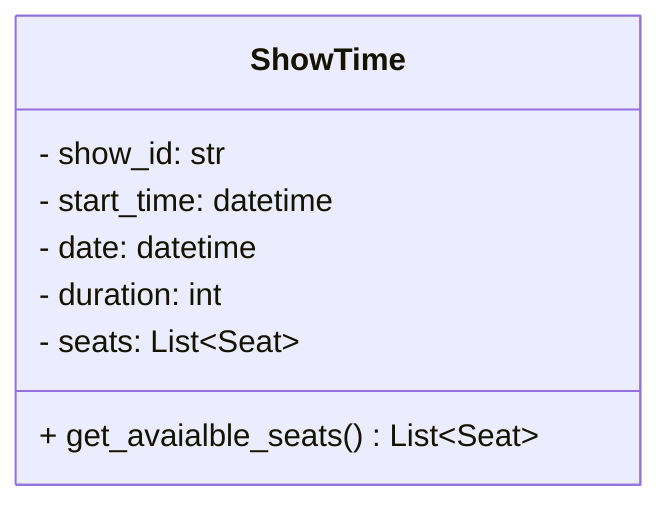
## Hall
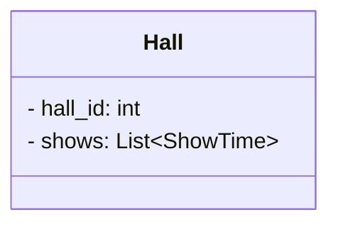

## Cinemas
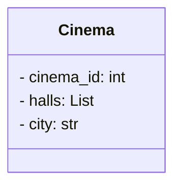

## City
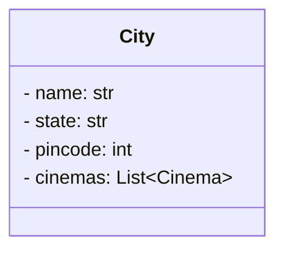

## Movie
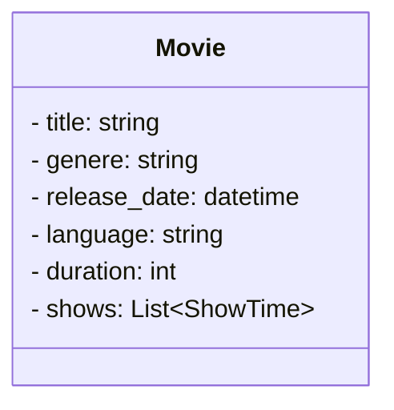
## Movie Ticket

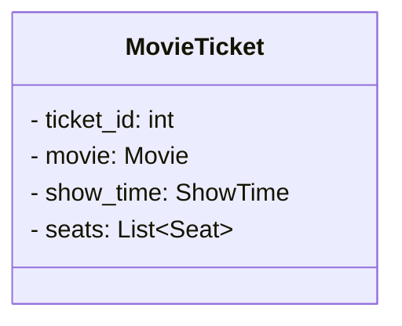

## Payment
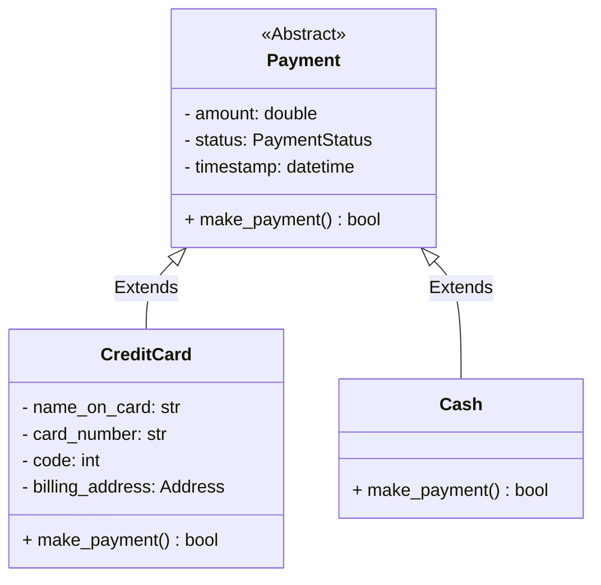
## Person
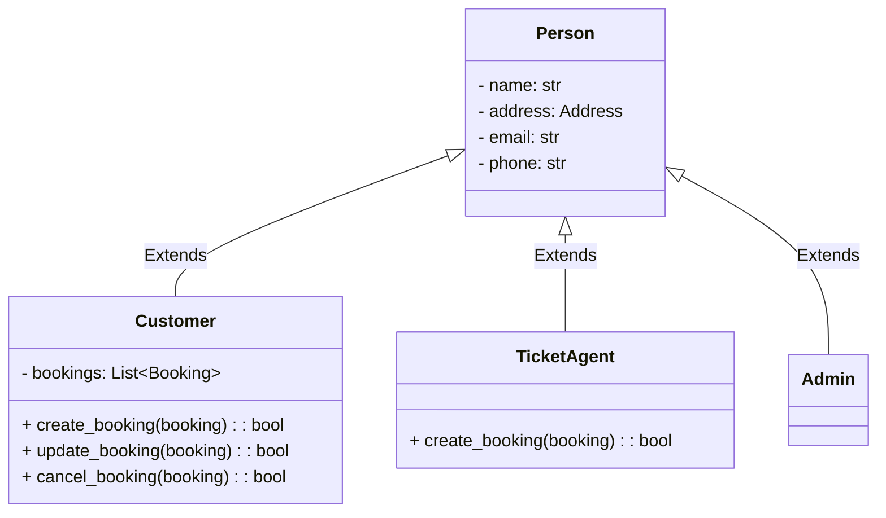

## Booking
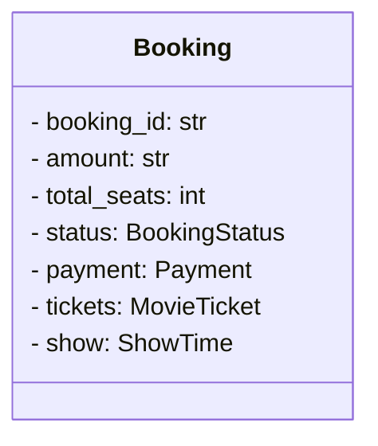

## Enums
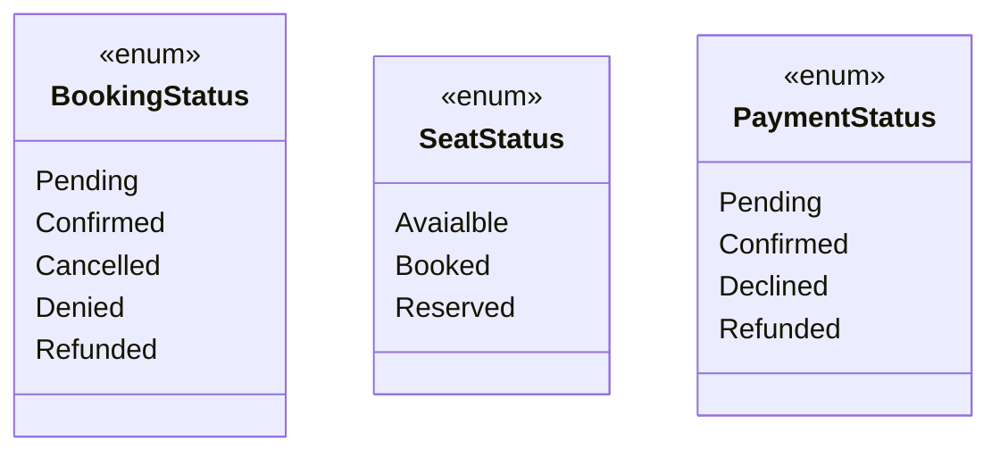

## Relationship

### Association
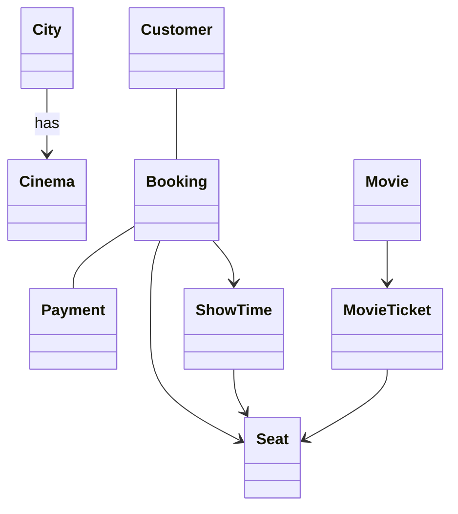

### Composition
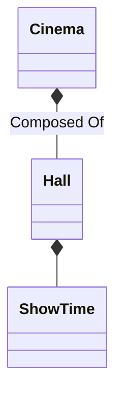

### Aggregation
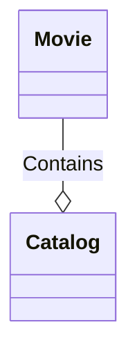

### Generalisation
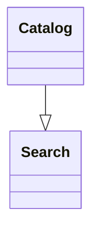

