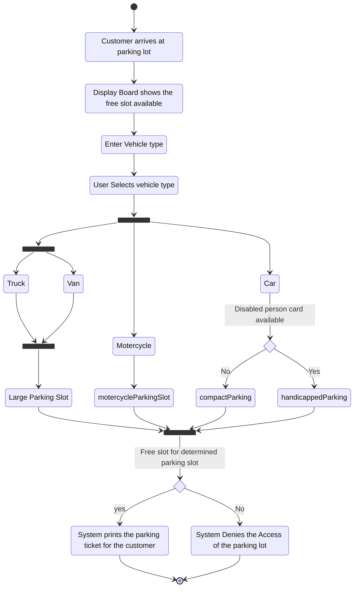
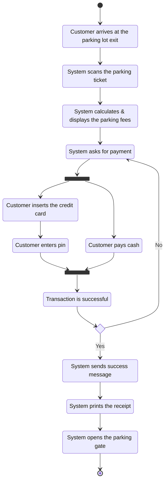

# Activity Diagram
## Vehicle entering the parking lot

```mermaid
stateDiagram-v2
    [*] --> cAt 
    cAt --> displayBoard
    displayBoard --> enterVehicleType
    enterVehicleType --> selectVehicleType

    state fork_vehicle_large <<fork>>
        fork_vehicle_large --> Truck
        fork_vehicle_large --> Van

    state fork_vehicle <<fork>>
        fork_vehicle --> Car
        fork_vehicle --> fork_vehicle_large
        fork_vehicle --> Motercycle

    selectVehicleType --> fork_vehicle
    
    state join_vehicle_large <<join>>
        Truck --> join_vehicle_large
        Van --> join_vehicle_large
    join_vehicle_large --> largeParkingSlot
    Motercycle --> motercycleParkingSlot

    state if_disabled <<choice>>
        if_disabled --> compactParking: No
        if_disabled --> handicappedParking: Yes
    Car --> if_disabled: Disabled person card available

    state join_parking_slot <<join>>
        largeParkingSlot --> join_parking_slot 
        motercycleParkingSlot --> join_parking_slot
        compactParking --> join_parking_slot
        handicappedParking --> join_parking_slot
    
    state if_slot_available <<choice>>
        if_slot_available --> successParkingTicket: yes
        if_slot_available --> failedParkingTicket: No

    join_parking_slot --> if_slot_available: Free slot for determined parking slot 

    successParkingTicket --> [*]
    failedParkingTicket --> [*]

    cAt: Customer arrives at parking lot
    displayBoard: Display Board shows the free slot available
    enterVehicleType: Enter Vehicle type
    selectVehicleType: User Selects vehicle type
    largeParkingSlot: Large Parking Slot
    successParkingTicket: System prints the parking ticket for the customer
    failedParkingTicket: System Denies the Access of the parking lot
```

## Customer Pays the parking ticket

```mermaid
stateDiagram-v2
[*] --> 1
1 --> 2
2 --> 3
3 --> 4
state fork_4 <<fork>>
    fork_4 --> 5
    fork_4 --> 7
4 --> fork_4
5 --> 6
state join_67 <<join>>
    6 --> join_67
    7 --> join_67
join_67 --> 8
state if_8 <<choice>>
    if_8 --> 9: Yes
    if_8 --> 4: No
8 --> if_8
9 --> 10
10 --> 11
11 --> [*]

1: Customer arrives at the parking lot exit
2: System scans the parking ticket
3: System calculates & displays the parking fees
4: System asks for payment
5: Customer inserts the credit card
6: Customer enters pin
7: Customer pays cash
8: Transaction is successful
9: System sends success message
10: System prints the receipt
11: System opens the parking gate
```