# Class Diagram
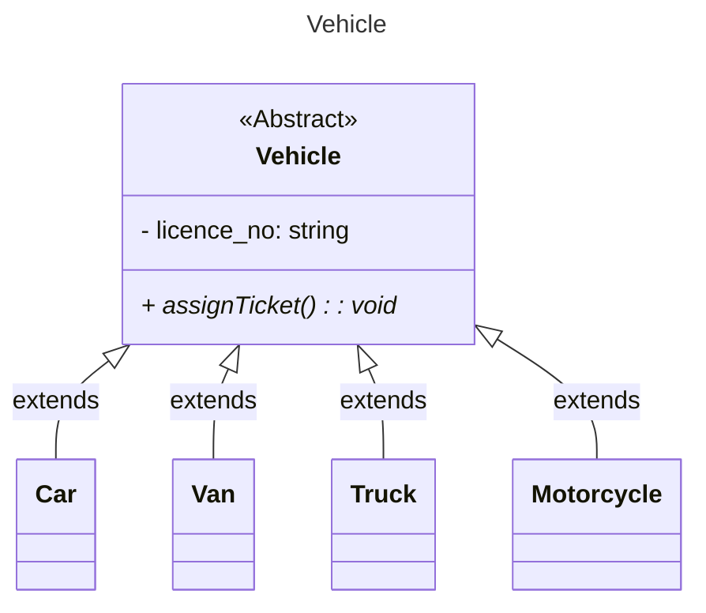
```mermaid
---
title: Vehicle
---
classDiagram
class Vehicle{
    <<Abstract>>
    - licence_no: string
    + assignTicket()*: void
}
Vehicle <|-- Car : extends
Vehicle <|-- Van : extends
Vehicle <|-- Truck : extends
Vehicle <|-- Motorcycle : extends

```

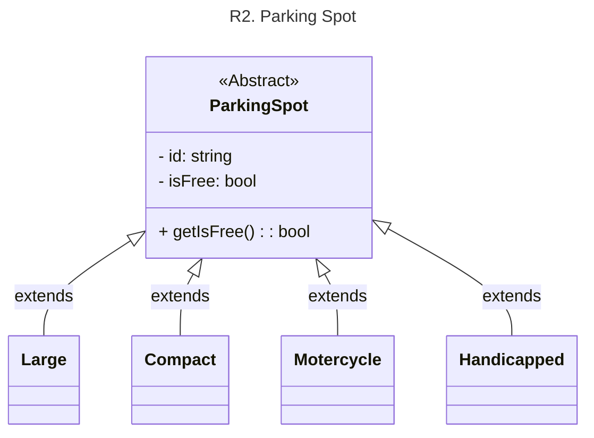
```mermaid
---
title: R2. Parking Spot
---
classDiagram
class ParkingSpot{
    <<Abstract>>
    - id: string
    - isFree: bool
    + getIsFree(): bool
}
ParkingSpot <|-- Large : extends
ParkingSpot <|-- Compact : extends
ParkingSpot <|-- Motercycle : extends
ParkingSpot <|-- Handicapped : extends

```

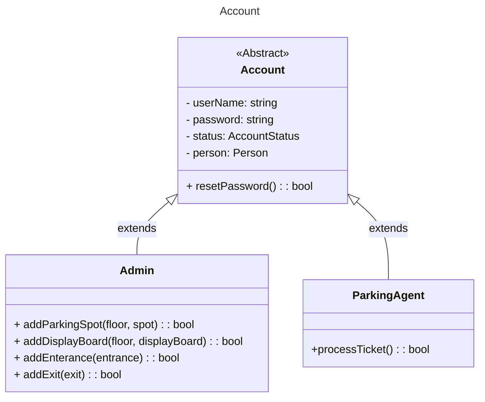
```mermaid
---
title: Account
---
classDiagram
class Account{
    <<Abstract>>
    - userName: string
    - password: string
    - status: AccountStatus
    - person: Person
    + resetPassword(): bool
}

class Admin{
    + addParkingSpot(floor, spot): bool
    + addDisplayBoard(floor, displayBoard): bool
    + addEnterance(entrance): bool
    + addExit(exit): bool
}

class ParkingAgent{
    +processTicket(): bool
}

Account <|-- Admin : extends
Account <|-- ParkingAgent : extends
```

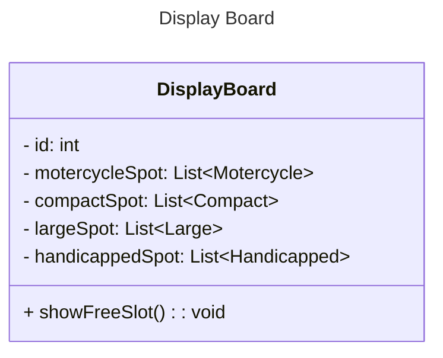
```mermaid
---
title: Display Board
---
classDiagram
class DisplayBoard{
    - id: int
    - motercycleSpot: List~Motercycle~
    - compactSpot: List~Compact~
    - largeSpot: List~Large~
    - handicappedSpot: List~Handicapped~
    + showFreeSlot(): void
}
```

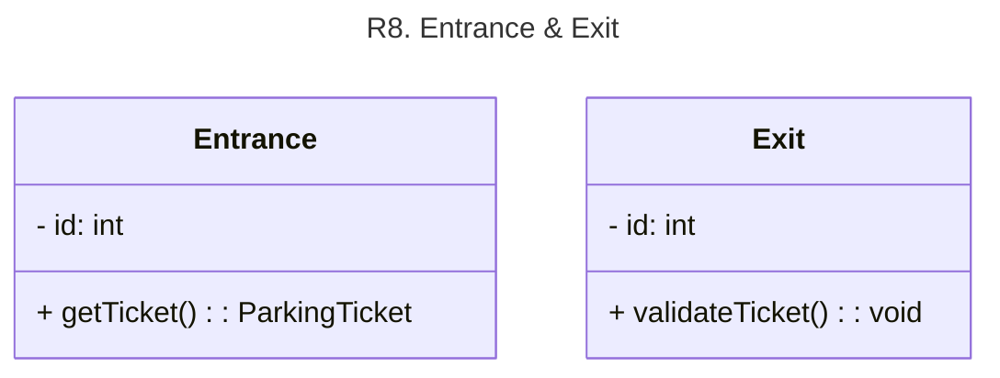
```mermaid
---
title: R8. Entrance & Exit
desc: Customers should be able to collect a parking ticket from the entrance and pay at the exit.
---
classDiagram
class Entrance{
 - id: int
 + getTicket(): ParkingTicket
}

class Exit{
 - id: int
 + validateTicket(): void
}
```

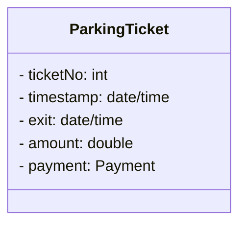
```mermaid
classDiagram
class ParkingTicket{
    - ticketNo: int
    - timestamp: date/time
    - exit: date/time
    - amount: double
    - payment: Payment
}
```

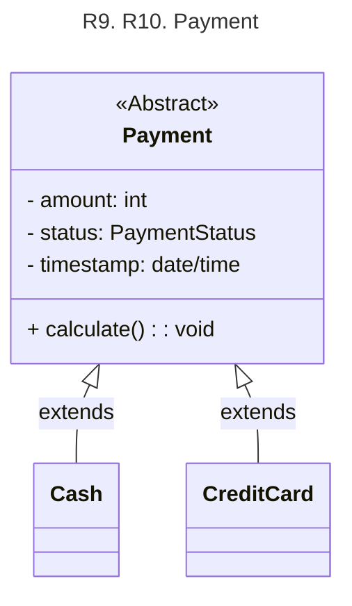
```mermaid
---
title: R9. R10. Payment
---
classDiagram
class Payment{
    <<Abstract>>
    - amount: int
    - status: PaymentStatus
    - timestamp: date/time
    + calculate(): void
}
Payment <|-- Cash : extends
Payment <|-- CreditCard: extends
```

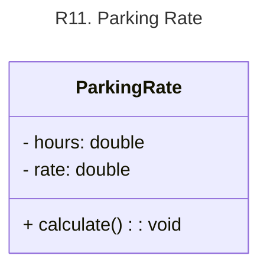
```mermaid
---
title: R11. Parking Rate
---
classDiagram
class ParkingRate{
    - hours: double
    - rate: double
    + calculate(): void
}
```

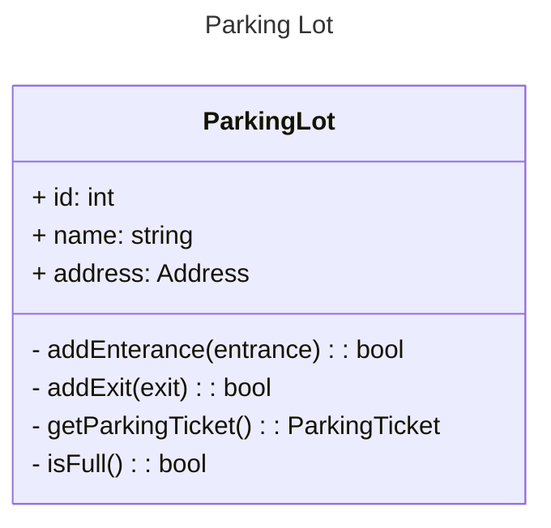
```mermaid
---
title: Parking Lot 
---
classDiagram
class ParkingLot{
    + id: int
    + name: string
    + address: Address
    - addEnterance(entrance): bool
    - addExit(exit): bool
    - getParkingTicket(): ParkingTicket
    - isFull(): bool
}

```

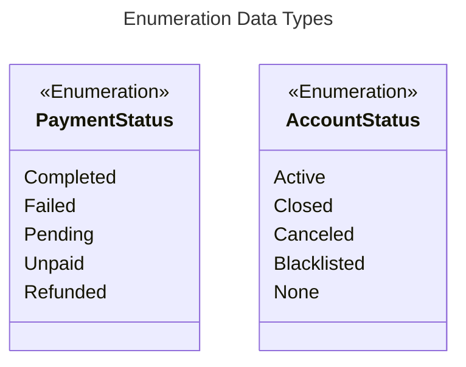
```mermaid
---
title: Enumeration Data Types 
---
classDiagram
class PaymentStatus{
    <<Enumeration>>
    Completed
    Failed
    Pending
    Unpaid
    Refunded
}

class AccountStatus{
    <<Enumeration>>
    Active
    Closed
    Canceled
    Blacklisted
    None
}
```

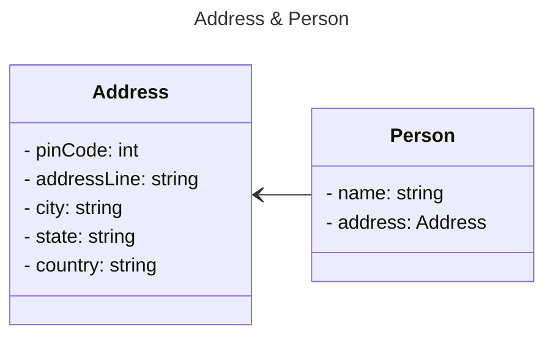
```mermaid
---
title: Address & Person
---
classDiagram
direction RL
class Address{
    - pinCode: int
    - addressLine: string
    - city: string
    - state: string
    - country: string
}
class Person{
    - name: string
    - address: Address
}
Person --> Address
```

## Relationship Between Classes
### Association
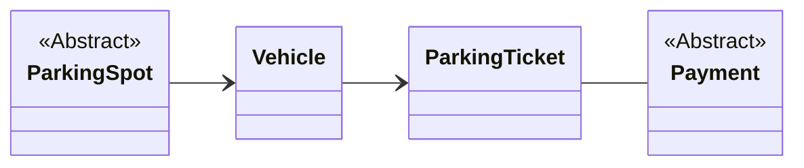
```mermaid
classDiagram
direction LR
class ParkingSpot
<<Abstract>> ParkingSpot
ParkingSpot --> Vehicle
Vehicle --> ParkingTicket
ParkingTicket -- Payment
<<Abstract>> Payment
```
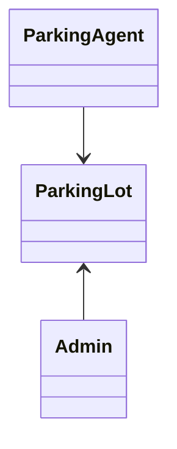
```mermaid
classDiagram
ParkingLot <-- Admin
ParkingAgent --> ParkingLot
```

### Composition
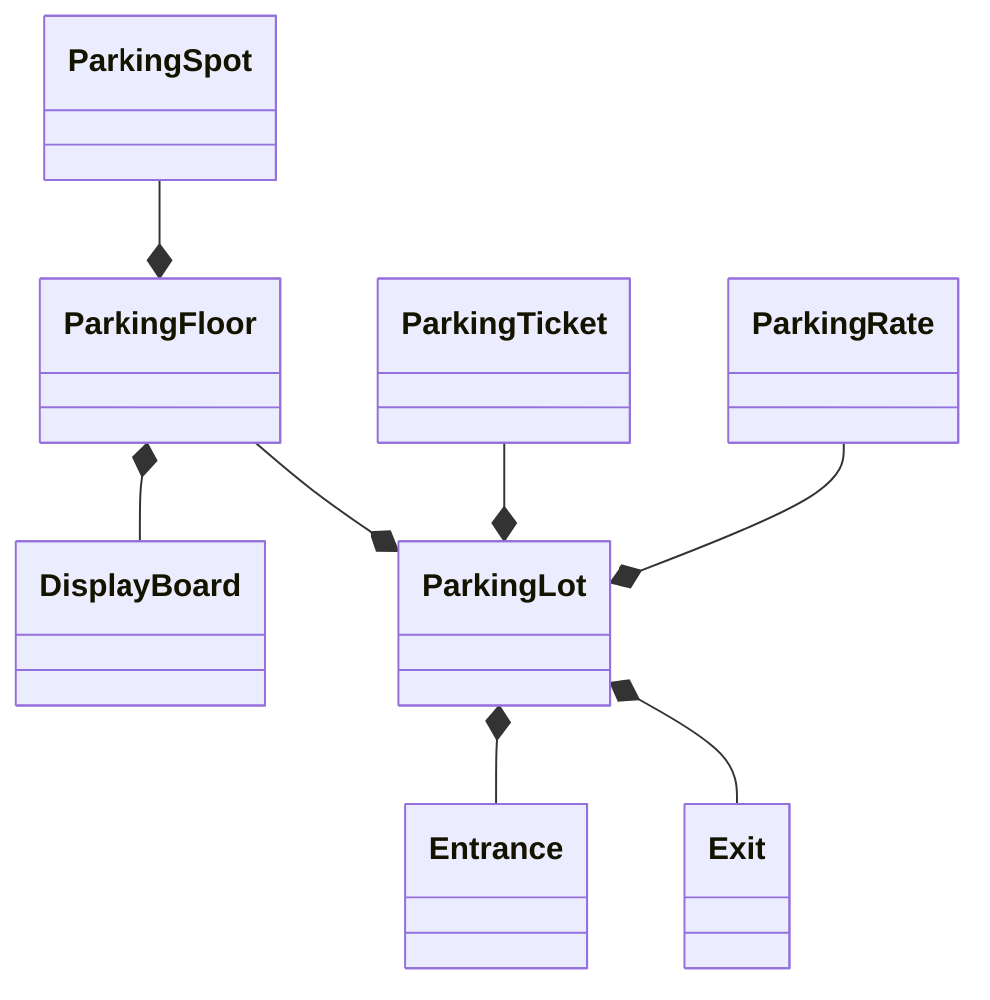
```mermaid
classDiagram
ParkingFloor *-- DisplayBoard
ParkingLot *-- Entrance
ParkingLot *-- Exit
ParkingSpot --* ParkingFloor
ParkingTicket --* ParkingLot
ParkingRate --* ParkingLot
ParkingFloor --* ParkingLot
```

### Inheritance
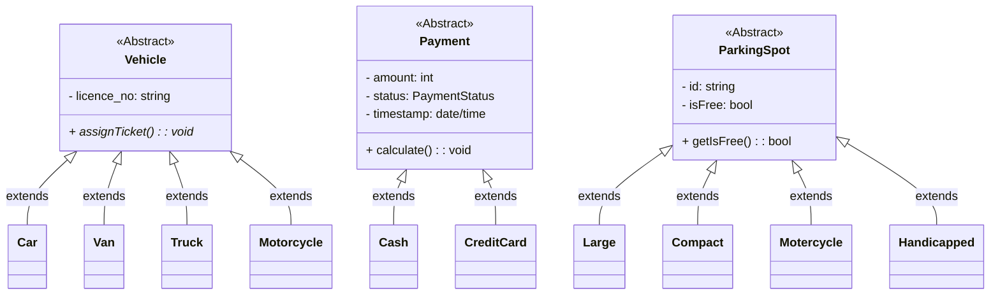
```mermaid
classDiagram
direction TB
class Vehicle{
    <<Abstract>>
    - licence_no: string
    + assignTicket()*: void
}
Vehicle <|-- Car : extends
Vehicle <|-- Van : extends
Vehicle <|-- Truck : extends
Vehicle <|-- Motorcycle : extends

class Payment{
    <<Abstract>>
    - amount: int
    - status: PaymentStatus
    - timestamp: date/time
    + calculate(): void
}
Payment <|-- Cash : extends
Payment <|-- CreditCard: extends

class ParkingSpot{
    <<Abstract>>
    - id: string
    - isFree: bool
    + getIsFree(): bool
}
ParkingSpot <|-- Large : extends
ParkingSpot <|-- Compact : extends
ParkingSpot <|-- Motercycle : extends
ParkingSpot <|-- Handicapped : extends
```