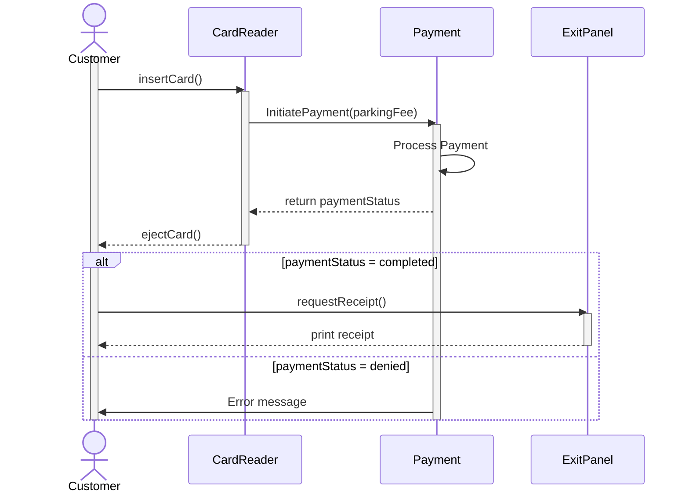
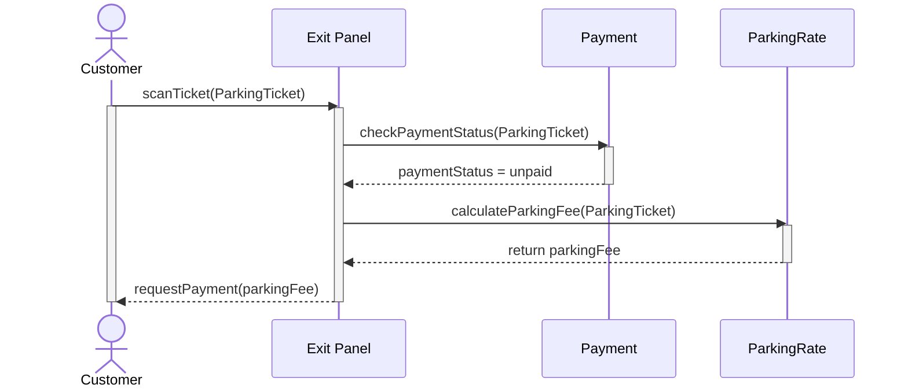

# Sequence Diagram

## Card Payment

```mermaid
sequenceDiagram
    Actor Customer
    activate Customer
    Customer->>CardReader: insertCard()
    activate CardReader
    CardReader->>Payment: InitiatePayment(parkingFee)
    activate Payment
    Payment->>Payment: Process Payment
    Payment-->>CardReader: return paymentStatus
    CardReader-->>Customer: ejectCard()
    deactivate CardReader
    alt paymentStatus = completed
        Customer ->> ExitPanel: requestReceipt()
        activate ExitPanel
        ExitPanel -->> Customer: print receipt
        deactivate ExitPanel
    else paymentStatus = denied
        Payment ->> Customer: Error message
    end
    deactivate Payment
    deactivate Customer
```

## Payment Verification

```mermaid
sequenceDiagram
actor Customer
Customer ->> Exit Panel: scanTicket(ParkingTicket)
activate Customer
activate Exit Panel
Exit Panel ->> Payment: checkPaymentStatus(ParkingTicket)
activate Payment
Payment -->> Exit Panel: paymentStatus = unpaid
deactivate Payment
Exit Panel ->> ParkingRate: calculateParkingFee(ParkingTicket)
activate ParkingRate
ParkingRate -->> Exit Panel: return parkingFee
deactivate ParkingRate
Exit Panel -->> Customer: requestPayment(parkingFee)
deactivate Customer
deactivate Exit Panel
```