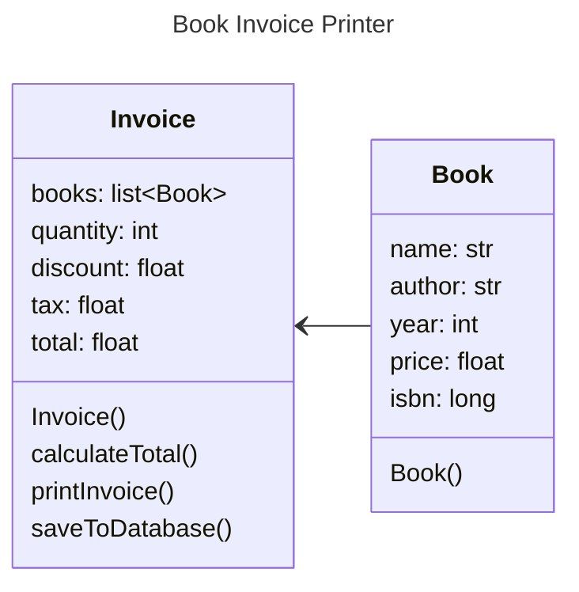
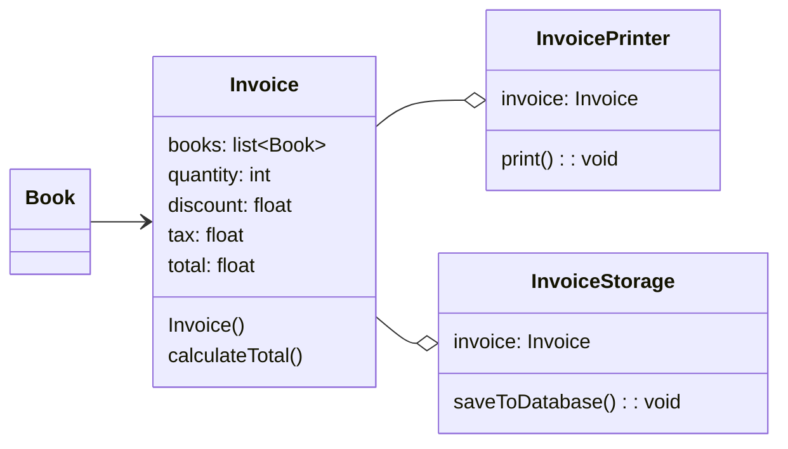
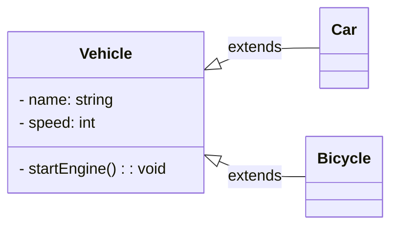
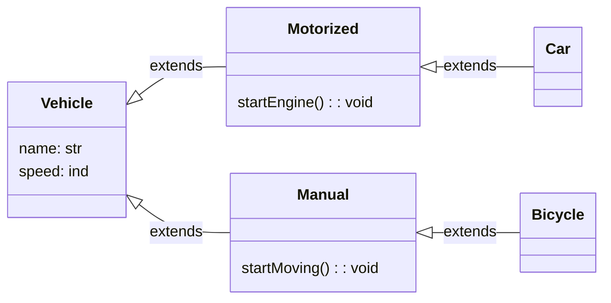
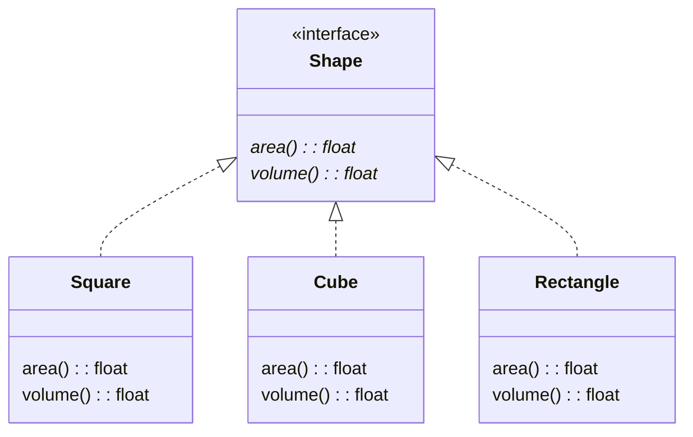
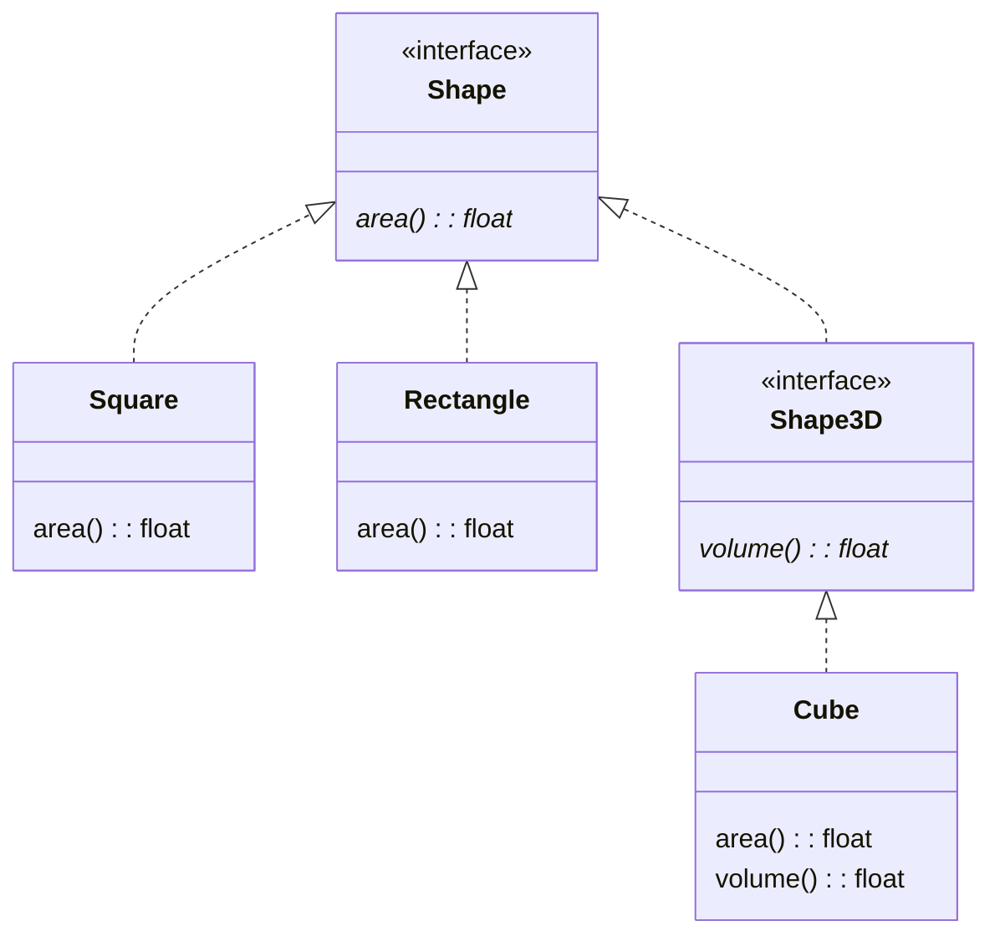
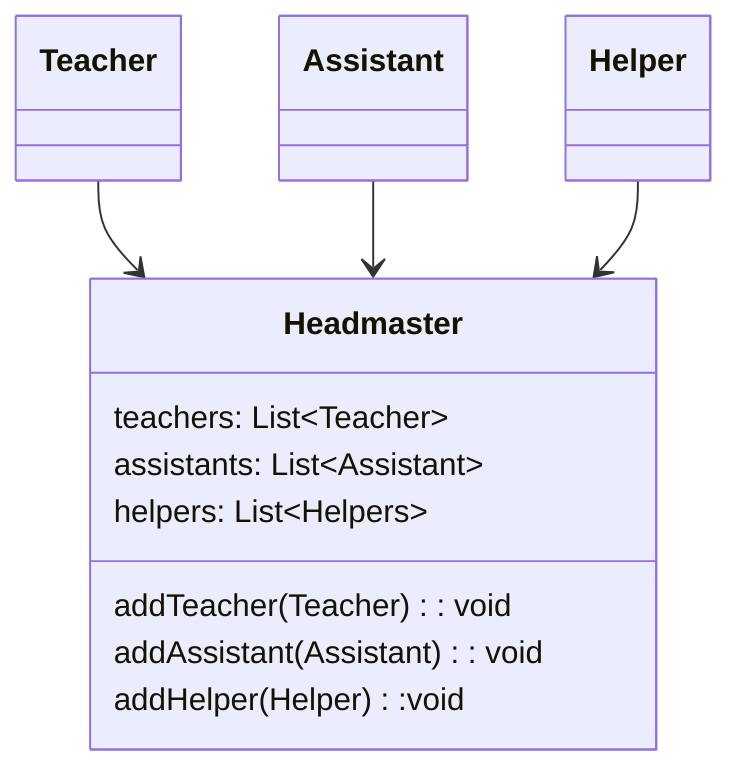
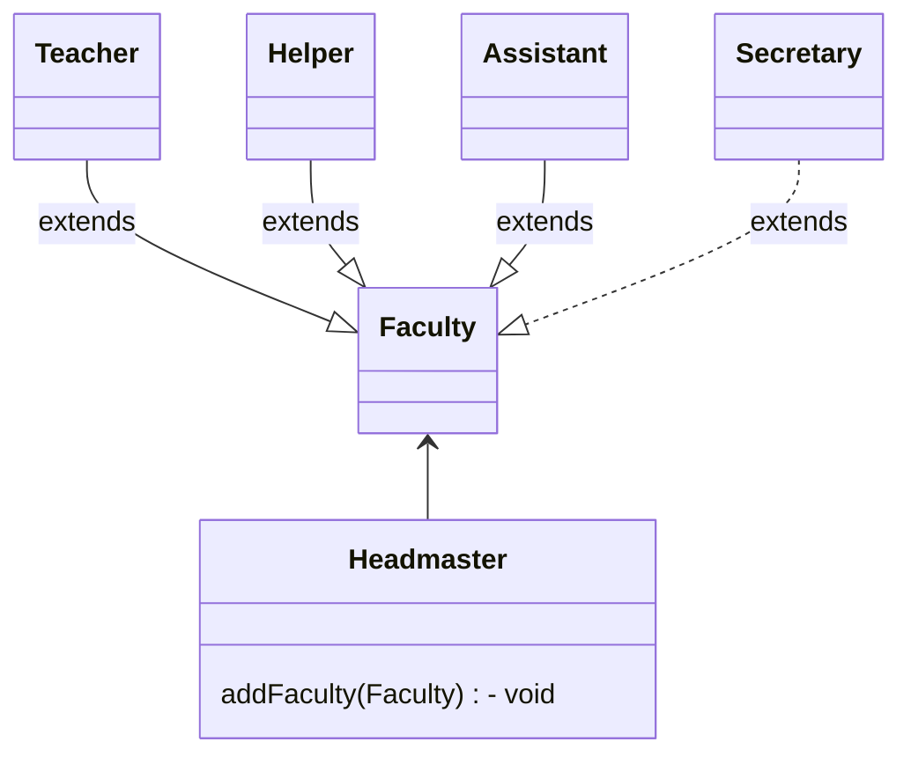

# Solid Design Principle
|||
|--|--|
|S| [Single Responsibility Principle (SRP)](#single-responsibility-principle)|
|O| [Open Close Principle (OCP)](#open-close-principle) |
|L| [Liskov Substitution Principle (LSP)](#liskov-substitution-principle)|
|I| [Interface Segregation Principle (ISP)](#interface-segrigation-principle)|
|D| [Dependency Inversion Principle (DIP)](#dependency-inversion-principle)|

## Single Responsibility Principle
A class should have onle one reason to change
### Problem

We have added Print & Storage functionality

### Solution

## Open Close Principle
A software artifact should be open for extension but close for modification

## Liskov Substitution Principle
Object of a subclass should behave the same way as of the superclass. Applies to abstraction concept like inheritance & polymorphism.

### Problem

### Solution

## Interface Segrigation Principle
Doesn't recommend having methods thatan interface would not use and require.

Precise code design thst follows the correct abstraction guidelines.

### Problem

### Solution

## Dependency Inversion Principle
High level models should not depend on low level modules but rather should both depends on abstractions

### Problem

If additional faculty comes under headmaster, it will be difficult to add without changing the Headmaster.

### Solution

