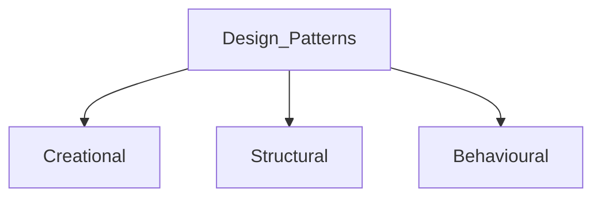

# Design Patterns  

  
## Creational   
- Factory  
- Abstract Factory  
- Builder  
- Prototype  
- Singleton  
  
## Structural  
- Adaptar  
- Bridge  
- Composite  
- Decorator  
- Facade  
- Flyweight  
- Proxy  
  
## Behavioural  
- Chain of Responsibility: Chain of events  
- Command: List of commands(Action/Undo)  
- Iterator:   
- Mediator  
- Memento  
- Observer:   
- State  
- Strategy: Add dynamic behavior during runtime  
- Template Method  
- Visitor