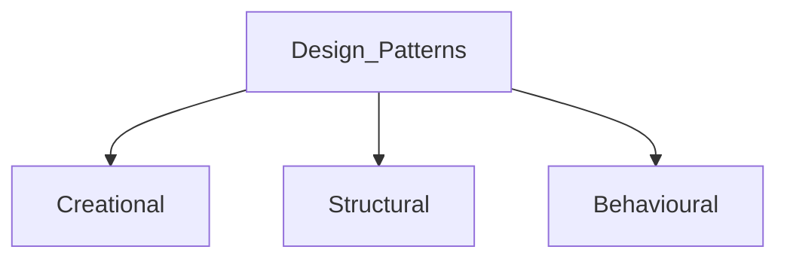

# Design Patterns  

  
## Creational 
Flexibility to create objects.  
- **Factory** : It provides an interface for creating objects in a superclass, but allows subclasses to alter the type of objects that will be created. It provides a template. Where the type of obj required varies and need to be specidfied.   
- **Abstract Factory** : Similar to factory. Lets you produce families of related objects without specifying their concrete classes.
- **Builder** : Build complex objects using simpler objects flexible and step by step approach. sheilds represenration from process of creation 
- **Prototype**: Instanciate obj with some default value from exiting object. Clones the object.  
- **Singleton**: Single instance on an object
- **Constructor**  
  
## Structural
Class/Object composition & relationship. Let add new functionalities so that restructuring doesn't affect other parts  
- **Adaptar**  
- **Bridge**  
- **Composite**  
- **Decorator**: Add properties, functionalities & behaviour to existing class dynamically. 
- **Facade** : _"Facade"_ means deceptive front or appearance hides complex logic from client and display only easy to use interface to them.
- **Flyweight**  
- **Proxy**  
  
## Behavioural  
Communication between dissimilar objects. Ensure the info is sync between obj.
- **Chain of Responsibility**: Chain of events  
- **Command**: List of commands(Action/Undo)  
- **Iterator**:   
- **Mediator**  
- **Memento**  
- **Observer**:   
- **State**  
- **Strategy**: Add dynamic behavior during runtime  
- **Template** Method  
- **Visitor**