# Class Diagram
## Class Notation
### Class

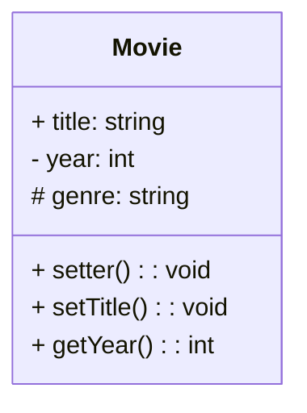
### Access Modifier
| Public | Protected | Private |Package/Internal |
|--|--|--|--|
| - | # | +| ~ | 

### Enumeration
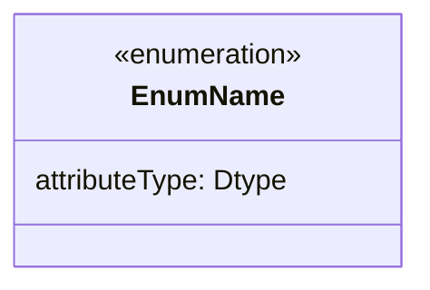
### Interface
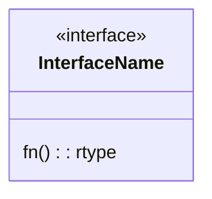

### Abstract
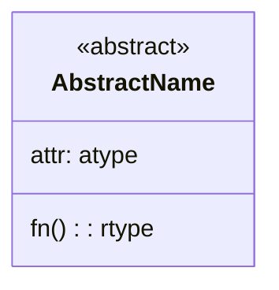

## Relations
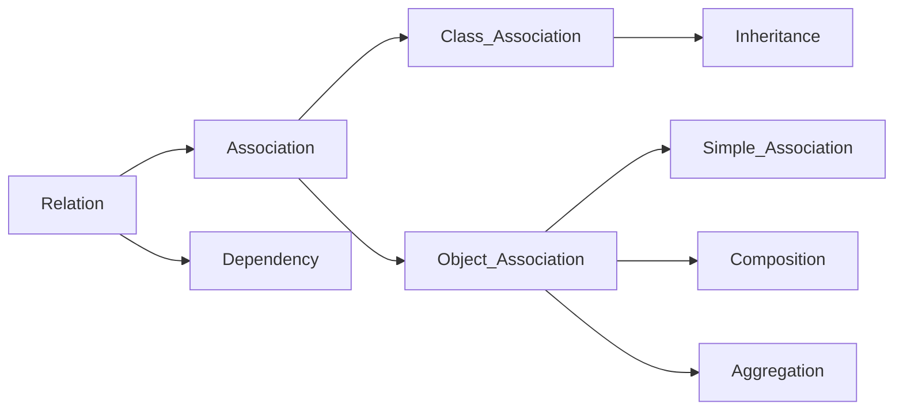

### Association: Comunicate one to another object
#### __Class Association__
Inheritance Releationship

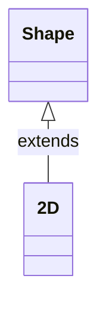
#### __Object Association__
1. **Simple**
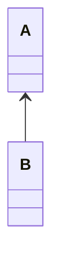
2. **Aggregation**: Has independent existance
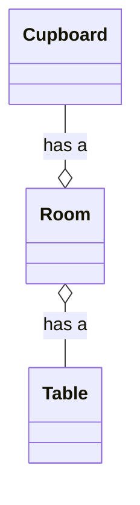

3. **Composition**: Parts to built the object
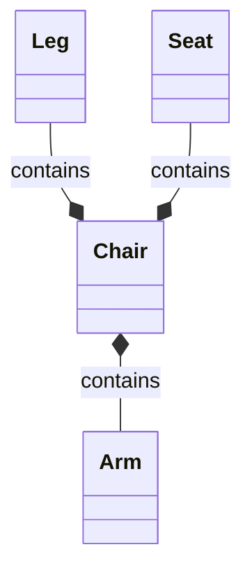
### Dependency
Class Dependent on another
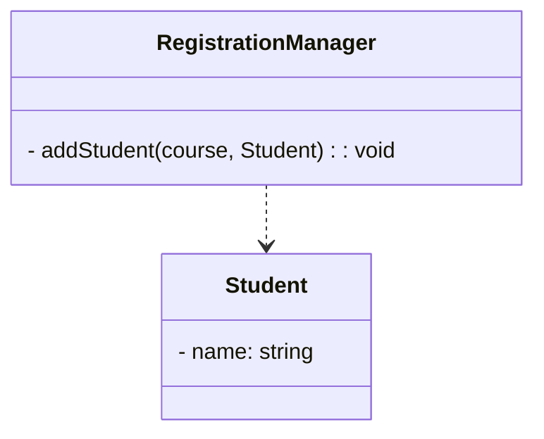

### Relationships
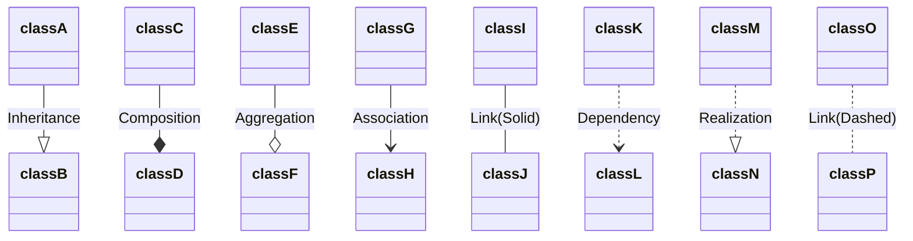